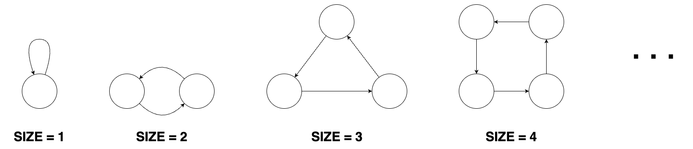
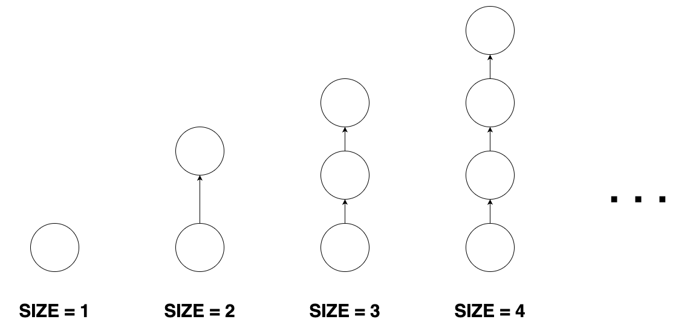
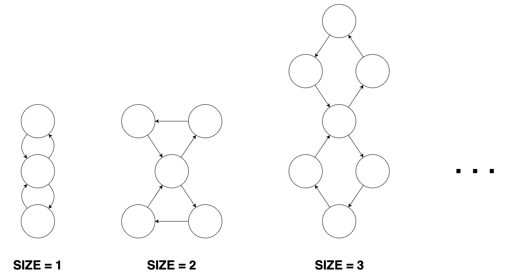
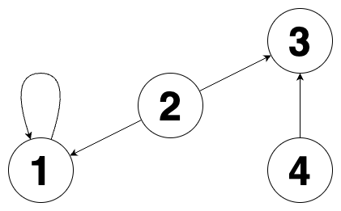
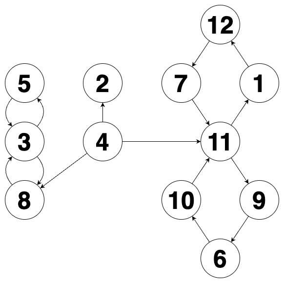

### 문제 설명
도넛 모양 그래프, 막대 모양 그래프, 8자 모양 그래프들이 있습니다. 

이 그래프들은 1개 이상의 정점과, 정점들을 연결하는 단방향 간선으로 이루어져 있습니다.

크기가 n인 도넛 모양 그래프는 n개의 정점과 n개의 간선이 있습니다. 

도넛 모양 그래프의 아무 한 정점에서 출발해 이용한 적 없는 간선을 계속 따라가면 나머지 n-1개의 정점들을 한 번씩 방문한 뒤 원래 출발했던 정점으로 돌아오게 됩니다. 도넛 모양 그래프의 형태는 다음과 같습니다.


크기가 n인 막대 모양 그래프는 n개의 정점과 n-1개의 간선이 있습니다. 

막대 모양 그래프는 임의의 한 정점에서 출발해 간선을 계속 따라가면 나머지 n-1개의 정점을 한 번씩 방문하게 되는 정점이 단 하나 존재합니다. 막대 모양 그래프의 형태는 다음과 같습니다.


크기가 n인 8자 모양 그래프는 2n+1개의 정점과 2n+2개의 간선이 있습니다.

8자 모양 그래프는 크기가 동일한 2개의 도넛 모양 그래프에서 정점을 하나씩 골라 결합시킨 형태의 그래프입니다. 8자 모양 그래프의 형태는 다음과 같습니다.


도넛 모양 그래프, 막대 모양 그래프, 8자 모양 그래프가 여러 개 있습니다. 이 그래프들과 무관한 정점을 하나 생성한 뒤, 각 도넛 모양 그래프, 막대 모양 그래프, 8자 모양 그래프의 임의의 정점 하나로 향하는 간선들을 연결했습니다.

그 후 각 정점에 서로 다른 번호를 매겼습니다.

이때 당신은 그래프의 간선 정보가 주어지면 생성한 정점의 번호와 정점을 생성하기 전 도넛 모양 그래프의 수, 막대 모양 그래프의 수, 8자 모양 그래프의 수를 구해야 합니다.

그래프의 간선 정보를 담은 2차원 정수 배열 edges가 매개변수로 주어집니다.

이때, 생성한 정점의 번호, 도넛 모양 그래프의 수, 막대 모양 그래프의 수, 8자 모양 그래프의 수를 순서대로 1차원 정수 배열에 담아 return 하도록 solution 함수를 완성해 주세요.

---
### 제한사항
* 1 ≤ edges의 길이 ≤ 1,000,000
	* edges의 원소는 [a,b] 형태이며, a번 정점에서 b번 정점으로 향하는 간선이 있다는 것을 나타냅니다.
	* 1 ≤ a, b ≤ 1,000,000
* 문제의 조건에 맞는 그래프가 주어집니다.
* 도넛 모양 그래프, 막대 모양 그래프, 8자 모양 그래프의 수의 합은 2이상입니다.

---

### 입출력 예

edges|result
---|---
[[2, 3], [4, 3], [1, 1], [2, 1]]|[2, 1, 1, 0]
[[4, 11], [1, 12], [8, 3], [12, 7], [4, 2], [7, 11], [4, 8], [9, 6], [10, 11], [6, 10], [3, 5], [11, 1], [5, 3], [11, 9], [3, 8]]|[4, 0, 1, 2]

---
### 입출력 예 설명

>입출력 예 #1

주어진 그래프를 그림으로 나타내면 다음과 같습니다.



2번 정점이 생성한 정점이고 도넛 모양 그래프 1개, 막대 모양 그래프 1개가 존재합니다. 따라서 [2, 1, 1, 0]을 return 해야 합니다.

>입출력 예 #2

주어진 그래프를 그림으로 나타내면 다음과 같습니다.



4번 정점이 생성한 정점이고 막대 모양 그래프 1개, 8자 모양 그래프 2개가 존재합니다. 따라서 [4, 0, 1, 2]를 return 해야 합니다.

---

### 풀이

#### golang
> 
```golang
func solution(friends []string, gifts []string) int {

	totalMaps := make(map[string]map[string]int)
	sumMap := make(map[string]int)

	for _, friend := range friends {
		totalMaps[friend] = make(map[string]int)
		sumMap[friend] = 0
	}

	for friend, totalMap := range totalMaps {
		for _, friend2 := range friends {
			if friend != friend2 {
				totalMap[friend2] = 0
			}
		}
	}

	for _, gift := range gifts {
		giver := strings.Split(gift, " ")[0]
		receiver := strings.Split(gift, " ")[1]

		sumMap[giver]++
		sumMap[receiver]--

		totalMaps[giver][receiver]++
	}

	resultMap := make(map[string]int)

	for giver, totalMap := range totalMaps {
		for receiver, _ := range totalMap {
			if giver != receiver {
				_, ok := totalMaps[giver][receiver]
				_, ok2 := totalMaps[receiver][giver]

				if ok && ok2 {
					if totalMaps[giver][receiver] == totalMaps[receiver][giver] {
						if sumMap[giver] > sumMap[receiver] {
							resultMap[giver] += 1
						}
					}

					if totalMaps[giver][receiver] > totalMaps[receiver][giver] {
						resultMap[giver] += 1
					}
				} else {
					if sumMap[giver] > sumMap[receiver] {
						resultMap[giver] += 1
					}
				}
			}
		}
	}

	maxGifts := 0
	for _, gifts := range resultMap {
		if gifts > maxGifts {
			maxGifts = gifts
		}
	}

	return maxGifts
}
```
정확성 | 테스트
---|---
테스트 1 |	통과 (0.03ms, 4.28MB)
테스트 2 |	통과 (0.02ms, 3.77MB)
테스트 3 |	통과 (0.10ms, 4.19MB)
테스트 4 |	통과 (0.10ms, 4.2MB)
테스트 5 |	통과 (1.12ms, 4.2MB)
테스트 6 |	통과 (0.27ms, 4.1`9MB)
테스트 7 |	통과 (0.77ms, 4.13MB)
테스트 8 |	통과 (0.96ms, 4.21MB)
테스트 9 |	통과 (3.22ms, 4.27MB)
테스트 10 |	통과 (3.83ms, 3.79MB)
테스트 11 |	통과 (2.91ms, 3.68MB)
테스트 12 |	통과 (2.65ms, 4.19MB)
테스트 13 |	통과 (7.79ms, 4.84MB)
테스트 14 |	통과 (4.14ms, 4.82MB)
테스트 15 |	통과 (5.09ms, 4.9MB)
테스트 16 |	통과 (7.98ms, 5.07MB)
테스트 17 |	통과 (0.09ms, 3.54MB)
테스트 18 |	통과 (1.93ms, 4.14MB)
테스트 19 |	통과 (7.56ms, 4.73MB)
테스트 20 |	통과 (3.73ms, 4.2MB)

---
#### java
```java
class Solution {
    public int solution(String[] friends, String[] gifts) {
        Map<String, Map<String, Integer>> totalMaps = new HashMap<>();
        Map<String, Integer> sumMap = new HashMap<>();

        for (String friend : friends) {
            Map<String, Integer> friendMap = new HashMap<>();
            for (String otherFriend : friends) {
                if (!friend.equals(otherFriend)) {
                    friendMap.put(otherFriend, 0);
                }
            }
            totalMaps.put(friend, friendMap);
            sumMap.put(friend, 0);
        }

        for (String gift : gifts) {
            String[] parts = gift.split(" ");
            String giver = parts[0];
            String receiver = parts[1];

            sumMap.put(giver, sumMap.getOrDefault(giver, 0) + 1);
            sumMap.put(receiver, sumMap.getOrDefault(receiver, 0) - 1);

            Map<String, Integer> giverMap = totalMaps.get(giver);
            giverMap.put(receiver, giverMap.getOrDefault(receiver, 0) + 1);
        }

        Map<String, Integer> resultMap = new HashMap<>();

        for (String giver : totalMaps.keySet()) {
            for (String receiver : totalMaps.get(giver).keySet()) {
                if (!giver.equals(receiver)) {
                    int giverToReceiver = totalMaps.get(giver).getOrDefault(receiver, 0);
                    int receiverToGiver = totalMaps.get(receiver).getOrDefault(giver, 0);

                    if (giverToReceiver == receiverToGiver) {
                        if (sumMap.get(giver) > sumMap.get(receiver)) {
                            resultMap.put(giver, resultMap.getOrDefault(giver, 0) + 1);
                        }
                    } else if (giverToReceiver > receiverToGiver) {
                        resultMap.put(giver, resultMap.getOrDefault(giver, 0) + 1);
                    }
                }
            }
        }

        int maxGifts = 0;

        for (int giftsReceived : resultMap.values()) {
            if (giftsReceived > maxGifts) {
                maxGifts = giftsReceived;
            }
        }

        return maxGifts;
    }
}
```
정확성 | 테스트
---|---
테스트 1 |	통과 (0.34ms, 81MB)
테스트 2 |	통과 (0.32ms, 67.6MB)
테스트 3 |	통과 (0.77ms, 80.7MB)
테스트 4 |	통과 (0.42ms, 71.5MB)
테스트 5 |	통과 (4.32ms, 78.8MB)
테스트 6 |	통과 (1.05ms, 77.7MB)
테스트 7 |	통과 (3.42ms, 79.4MB)
테스트 8 |	통과 (3.67ms, 81.7MB)
테스트 9 |	통과 (7.69ms, 83.4MB)
테스트 10 |	통과 (11.78ms, 80.7MB)
테스트 11 |	통과 (11.40ms, 91.1MB)
테스트 12 |	통과 (9.69ms, 79.2MB)
테스트 13 |	통과 (15.55ms, 98.4MB)
테스트 14 |	통과 (20.22ms, 91.5MB)
테스트 15 |	통과 (23.50ms, 105MB)
테스트 16 |	통과 (15.93ms, 99.8MB)
테스트 17 |	통과 (0.56ms, 76.5MB)
테스트 18 |	통과 (10.32ms, 89.4MB)
테스트 19 |	통과 (17.82ms, 96.5MB)
테스트 20 |	통과 (8.05ms, 85.9MB)

---
#### kotlin
```kotlin
class Solution {
    fun solution(friends: Array<String>, gifts: Array<String>): Int {
        val totalMaps =
                friends
                        .associateWith { friend ->
                            friends.filter { it != friend }.associateWith { 0 }.toMutableMap()
                        }
                        .toMutableMap()
        val sumMap = friends.associateWith { 0 }.toMutableMap()

        gifts.forEach { gift ->
            val (giver, receiver) = gift.split(" ")
            sumMap[giver] = sumMap.getValue(giver) + 1
            sumMap[receiver] = sumMap.getValue(receiver) - 1

            val giverMap = totalMaps.getValue(giver)
            giverMap[receiver] = giverMap.getValue(receiver) + 1
        }

        val resultMap = mutableMapOf<String, Int>()
        totalMaps.forEach { (giver, receiverMap) ->
            receiverMap.forEach { (receiver, giverToReceiver) ->
                val receiverToGiver = totalMaps.getValue(receiver).getValue(giver)
                when {
                    giverToReceiver == receiverToGiver &&
                            sumMap.getValue(giver) > sumMap.getValue(receiver) ->
                            resultMap[giver] = resultMap.getOrDefault(giver, 0) + 1
                    giverToReceiver > receiverToGiver ->
                            resultMap[giver] = resultMap.getOrDefault(giver, 0) + 1
                }
            }
        }

        return resultMap.values.maxOrNull() ?: 0
    }
}
```
정확성 | 테스트
---|---
테스트 1 |	통과 (16.89ms, 61.9MB)
테스트 2 |	통과 (17.58ms, 63.1MB)
테스트 3 |	통과 (17.62ms, 62.5MB)
테스트 4 |	통과 (17.49ms, 62.3MB)
테스트 5 |	통과 (25.99ms, 66MB)
테스트 6 |	통과 (21.11ms, 62MB)
테스트 7 |	통과 (21.58ms, 65.5MB)
테스트 8 |	통과 (27.83ms, 64.7MB)
테스트 9 |	통과 (28.29ms, 71.6MB)
테스트 10 |	통과 (32.90ms, 70.9MB)
테스트 11 |	통과 (28.41ms, 70.8MB)
테스트 12 |	통과 (32.23ms, 69.3MB)
테스트 13 |	통과 (48.98ms, 80MB)
테스트 14 |	통과 (71.89ms, 77.7MB)
테스트 15 |	통과 (45.97ms, 81.9MB)
테스트 16 |	통과 (55.32ms, 80.6MB)
테스트 17 |	통과 (25.25ms, 61.8MB)
테스트 18 |	통과 (56.88ms, 69.4MB)
테스트 19 |	통과 (50.92ms, 83.3MB)
테스트 20 |	통과 (27.27ms, 66.6MB)

---
#### python
```python
def solution(friends, gifts):
    total_maps = {friend: {other: 0 for other in friends if other != friend} for friend in friends}
    sum_map = {friend: 0 for friend in friends}

    for gift in gifts:
        giver, receiver = gift.split()
        sum_map[giver] += 1
        sum_map[receiver] -= 1
        total_maps[giver][receiver] += 1

    result_map = {}
    for giver in total_maps:
        for receiver in total_maps[giver]:
            giver_to_receiver = total_maps[giver][receiver]
            receiver_to_giver = total_maps[receiver].get(giver, 0)

            if giver_to_receiver == receiver_to_giver:
                if sum_map[giver] > sum_map[receiver]:
                    result_map[giver] = result_map.get(giver, 0) + 1
            elif giver_to_receiver > receiver_to_giver:
                result_map[giver] = result_map.get(giver, 0) + 1

    return max(result_map.values(), default=0)
```
정확성 | 테스트
---|---
테스트 1 |	통과 (0.05ms, 10.2MB)
테스트 2 |	통과 (0.07ms, 10.1MB)
테스트 3 |	통과 (0.08ms, 10.1MB)
테스트 4 |	통과 (0.07ms, 10MB)
테스트 5 |	통과 (0.84ms, 10.4MB)
테스트 6 |	통과 (0.29ms, 10.1MB)
테스트 7 |	통과 (0.66ms, 10.2MB)
테스트 8 |	통과 (1.06ms, 10.3MB)
테스트 9 |	통과 (3.19ms, 10.6MB)
테스트 10 |	통과 (2.91ms, 10.4MB)
테스트 11 |	통과 (2.65ms, 10.4MB)
테스트 12 |	통과 (2.07ms, 10.3MB)
테스트 13 |	통과 (8.77ms, 10.8MB)
테스트 14 |	통과 (5.25ms, 10.4MB)
테스트 15 |	통과 (8.61ms, 10.5MB)
테스트 16 |	통과 (8.34ms, 10.8MB)
테스트 17 |	통과 (0.08ms, 10.1MB)
테스트 18 |	통과 (2.55ms, 10.5MB)
테스트 19 |	통과 (8.64ms, 10.6MB)
테스트 20 |	통과 (1.97ms, 10.4MB)

---
#### javascript
```javascript
function solution(friends, gifts) {
    const totalMaps = {};
    const sumMap = {};

    friends.forEach(friend => {
        totalMaps[friend] = {};
        sumMap[friend] = 0;
        friends.forEach(other => {
            if (other !== friend) {
                totalMaps[friend][other] = 0;
            }
        });
    });

    gifts.forEach(gift => {
        const [giver, receiver] = gift.split(" ");
        sumMap[giver]++;
        sumMap[receiver]--;
        totalMaps[giver][receiver]++;
    });

    const resultMap = {};
    for (let giver in totalMaps) {
        for (let receiver in totalMaps[giver]) {
            const giverToReceiver = totalMaps[giver][receiver];
            const receiverToGiver = totalMaps[receiver][giver] || 0;

            if (giverToReceiver === receiverToGiver) {
                if (sumMap[giver] > sumMap[receiver]) {
                    resultMap[giver] = (resultMap[giver] || 0) + 1;
                }
            } else if (giverToReceiver > receiverToGiver) {
                resultMap[giver] = (resultMap[giver] || 0) + 1;
            }
        }
    }

    return Math.max(...Object.values(resultMap), 0);
}
```
정확성 | 테스트
---|---
테스트 1 |	통과 (0.31ms, 33.4MB)
테스트 2 |	통과 (0.35ms, 33.7MB)
테스트 3 |	통과 (0.54ms, 33.7MB)
테스트 4 |	통과 (0.60ms, 33.6MB)
테스트 5 |	통과 (2.25ms, 33.8MB)
테스트 6 |	통과 (1.29ms, 33.5MB)
테스트 7 |	통과 (1.77ms, 33.8MB)
테스트 8 |	통과 (2.66ms, 33.9MB)
테스트 9 |	통과 (5.22ms, 36.8MB)
테스트 10 |	통과 (6.27ms, 37.1MB)
테스트 11 |	통과 (5.50ms, 37.1MB)
테스트 12 |	통과 (5.08ms, 36.8MB)
테스트 13 |	통과 (11.15ms, 37.7MB)
테스트 14 |	통과 (8.17ms, 37.1MB)
테스트 15 |	통과 (8.73ms, 37.4MB)
테스트 16 |	통과 (10.37ms, 37.8MB)
테스트 17 |	통과 (0.78ms, 33.5MB)
테스트 18 |	통과 (6.41ms, 36.8MB)
테스트 19 |	통과 (9.05ms, 37.4MB)
테스트 20 |	통과 (4.20ms, 36.6MB)